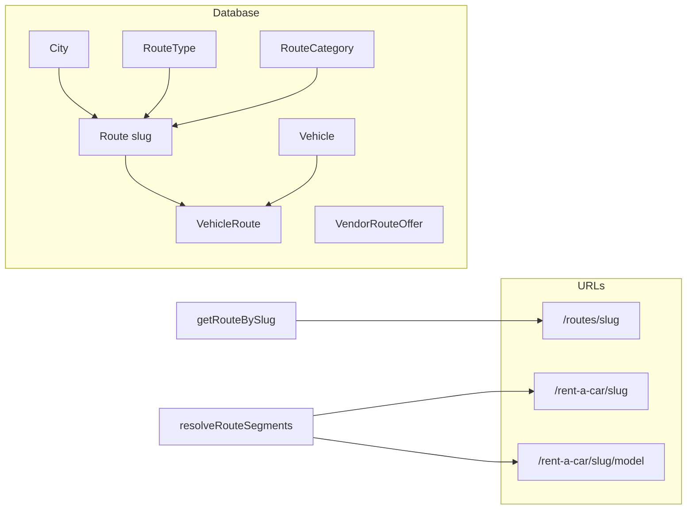

# Routes Taxonomy + Database + SEO + Pages

## Current state

- **City**: Exists in [prisma/schema.prisma](prisma/schema.prisma) with `id` (String uuid), `name`, `slug`, `province`, `countryId`. Reuse as-is.
- **Route (existing)**: Current `Route` is vendor/vehicle-specific (`vendorId`, `vehicleId`, `fromCityId`, `toCityId`, `basePrice`). Used by [src/app/(keyword)/routes/[slug]/page.tsx](src/app/(keyword)/routes/[slug]/page.tsx), [src/lib/data.ts](src/lib/data.ts) (`getCityRoutes`, `getCityStatsBySlug`), Booking.routeId, admin/vendor route UIs. **Must be renamed** so the new SEO "route definition" entity can be named `Route`.
- **Keyword resolver**: [src/lib/seo-resolver.ts](src/lib/seo-resolver.ts) has `resolveKeywordSegments` for keyword_only, keyword_city, keyword_city_model, keyword_filter_city. No route-slug handling yet.
- **Dynamic routing**: [src/app/(keyword)/[...segments]/page.tsx](src/app/(keyword)/[...segments]/page.tsx) uses `resolveKeywordSegments` only. Routes list is at `(keyword)/routes/page.tsx` with **hardcoded** `allRoutes` in [src/app/(keyword)/routes/page.tsx](src/app/(keyword)/routes/page.tsx).
- **Sitemap**: [src/app/sitemap.ts](src/app/sitemap.ts) includes keyword, keyword+city, vehicles; no route URLs.

---

## 1. Database and Prisma

**Rename existing Route**

- Rename current `Route` to **`VendorRouteOffer`** (or `RouteOffer`) to keep vendor-specific pricing and Booking relation.
- Update all references: `Booking.routeId` → point to `VendorRouteOffer` (e.g. `vendorRouteOfferId`), `City` relations `routesFrom`/`routesTo`, `Vendor.routes`, `Vehicle` (remove direct route relation if any; Vehicle will link to new Route via VehicleRoute only). Admin/vendor route forms and APIs continue to use VendorRouteOffer.

**New models (use existing City String ids)**

- **RouteType**: `id` (Int), `name`, `slug` @unique, `createdAt`; relation `routes Route[]`. Seed: intercity, airport-transfer, tour-route, event-route, intra-city.
- **RouteCategory**: `id` (Int), `name`, `slug` @unique, `createdAt`; relation `routes Route[]`. Seed: business, tourist, wedding, daily, long-distance.
- **Route** (new core entity): `id` (Int or String; recommend Int for simplicity), `slug` @unique, `originCityId` (String), `destinationCityId` (String), `routeTypeId`, `routeCategoryId`, `distanceKm` (Int?), `estimatedTime` (String?), `oneWay` (Boolean), `roundTrip` (Boolean), `createdAt`. Relations: `originCity` / `destinationCity` to City (use relation names that do not clash with VendorRouteOffer, e.g. `RouteOriginCity` / `RouteDestinationCity`), `routeType`, `routeCategory`, `vehicles` via VehicleRoute. `@@index([originCityId, destinationCityId])`.
- **VehicleRoute**: `id` (Int), `vehicleId` (String), `routeId`, `@@unique([vehicleId, routeId])`, relations to Vehicle and Route.

**City schema**

- Add relations to the **new** Route only (e.g. `routesAsOrigin Route[]`, `routesAsDestination Route[]`). Keep existing `routesFrom`/`routesTo` on City for VendorRouteOffer.

**Vehicle schema**

- Add `vehicleRoutes VehicleRoute[]` to Vehicle. Remove or keep `routes` for VendorRouteOffer depending on whether vendors still "attach" vehicles to VendorRouteOffer; if yes, keep that relation on VendorRouteOffer only.

**Migration**

- One migration: rename Route → VendorRouteOffer (with Booking and all FKs), then add RouteType, RouteCategory, Route, VehicleRoute and new City relations.

---

## 2. Seeding

**Route slug pattern**: `{{origin-city-slug}}-to-{{destination-city-slug}}` (e.g. lahore-to-islamabad).

- Seed RouteType and RouteCategory with the slugs/names you specified.
- Seed **Route**: for each major Pakistan route (reuse the list currently hardcoded in [src/app/(keyword)/routes/page.tsx](src/app/(keyword)/routes/page.tsx) or a similar list), ensure both cities exist in City, then create Route with slug `originSlug-to-destinationSlug`, assign a default routeType (e.g. intercity) and routeCategory (e.g. tourist). Optionally link vehicles to routes via VehicleRoute (e.g. vehicles whose city is origin or destination) so "routes with vehicles" are non-empty for sitemap and UI.

**No hardcoded route list in app code**: Routes list page and any "popular routes" should come from DB (e.g. `getRoutesForSitemap()` or a dedicated list function).

---

## 3. Data layer ([src/lib/data.ts](src/lib/data.ts))

Implement (with `cache()` where appropriate):

- **getRouteBySlug(slug)**  
  Returns route with `originCity`, `destinationCity`, `routeType`, `routeCategory`, and `vehicles` (via VehicleRoute) including vehicle `category`, `vehicleModel`, and prices. Return null if not found.

- **getRoutesByCity(citySlug)**  
  Routes where origin (or optionally destination) city matches; include same relations as above. Used for "popular routes" on city pages.

- **getRoutesByCities(originSlug, destinationSlug)**  
  Single route or list for that origin–destination pair; same shape.

- **getRoutesForSitemap()**  
  Routes that have at least one vehicle (via VehicleRoute); return minimal fields needed for sitemap (e.g. slug, and optionally origin/destination slugs for keyword+route URLs).

- **getVehiclesByRoute(routeId)**  
  Vehicles linked via VehicleRoute for that route, with category, model, prices (for RouteLandingPage and keyword+route pages).

All route queries must use the **new** Route model and include originCity, destinationCity, routeType, routeCategory, and vehicles (with category, model, prices) as specified.

---

## 4. SEO resolver ([src/lib/seo-resolver.ts](src/lib/seo-resolver.ts))

**Extend resolution for route-based URLs**

- Add **resolveRouteSegments(segments)** (or extend **resolveKeywordSegments** with route branches; both approaches are valid; below assumes a dedicated function that the catch-all can call when the first segment is a keyword).
- **Detection patterns**:
  - `[keyword, routeSlug]` → keyword + route (e.g. /rent-a-car/lahore-to-islamabad).
  - `[keyword, routeSlug, modelSlug]` → keyword + route + model (e.g. /rent-a-car/lahore-to-islamabad/toyota-corolla).
  - `[keyword, driverFilterSlug, routeSlug]` → keyword + driver filter + route (e.g. /rent-a-car/with-driver/lahore-to-islamabad); reuse existing `isDriverFilterSlug`.
- **Return type**: e.g. `{ route, keyword?, model?, driverOption?, canonical }` with route including originCity, destinationCity, routeType, routeCategory. Canonical should be the chosen URL (e.g. `/rent-a-car/lahore-to-islamabad`).
- **Integration**: In [src/app/(keyword)/[...segments]/page.tsx](src/app/(keyword)/[...segments]/page.tsx), after (or instead of) returning not_found from `resolveKeywordSegments`, try route resolution when segments look like keyword + route (e.g. first segment is a known keyword, second matches route slug pattern `*-to-*` or exists in DB). Then render the appropriate route page type and set metadata/canonical from the resolver result.

**Note**: `/routes/lahore-to-islamabad` is handled by a dedicated **app/routes/[slug]** route, not by the keyword catch-all; the resolver need not handle the literal first segment `routes` for that (it's a reserved segment already).

---

## 5. Dynamic routing

**Routes base (canonical route page)**

- Add **app/routes/[slug]/page.tsx** (at app root, not under (keyword)).
  - Use **getRouteBySlug(slug)**; if null, `notFound()`.
  - Render **RouteLandingPage** with route data (origin/destination, distance, time, vehicles, internal links to /rent-a-car/{routeSlug}, /vehicles/{category}, route-specific FAQs).
  - generateMetadata: title/description/canonical for "{Origin} to {Destination} Car Rental".

**Keyword + route (no hardcoding)**

- Handled in **app/(keyword)/[...segments]/page.tsx**:
  - When resolution yields **keyword + route** (no model): render **CityKeywordRouteLandingPage** (hero: "Rent a Car from {Origin} to {Destination}", SEO intro, vehicle listings, pricing, booking process, FAQs, CTA).
  - When **keyword + route + model**: render **CityKeywordRouteModelLandingPage** (hero: "{Model} Rent from {Origin} to {Destination}", model suitability, pricing, seating, driver option, route-specific advantages).
  - When **keyword + driver filter + route**: render a route variant of the existing filter landing page (e.g. CityKeywordRouteFilterLandingPage or reuse CityKeywordFilterLandingPage with route context).
- generateMetadata in the same page must use resolver output for title/description/canonical for these route page types.

**Existing (keyword)/routes/[slug]**

- Either remove and rely on **app/routes/[slug]** for canonical route pages, or keep (keyword)/routes/[slug] as a redirect to `/routes/[slug]` for consistency. Recommend single canonical at `/routes/[slug]`.

---

## 6. Page templates (components)

**RouteLandingPage** (used by app/routes/[slug]/page.tsx)

- H1: "{Origin} to {Destination} Car Rental".
- Route info: distance, estimated time, one-way/round-trip.
- List/grid of available vehicles (from getRouteBySlug → vehicles).
- Internal links: /rent-a-car/{routeSlug}, /vehicles/{categorySlug}.
- Route-specific FAQs (e.g. from FaqGroup or inline for "Lahore to Islamabad" type questions).

**CityKeywordRouteLandingPage** (keyword + route)

- Hero: "Rent a Car from {Origin} to {Destination}".
- Sections: SEO intro, vehicle listings, pricing explanation, booking process, FAQs, CTA. Reuse structure from [src/components/city/city-keyword-filter-landing-page.tsx](src/components/city/city-keyword-filter-landing-page.tsx) / city landing pages but with route context (origin/destination names, route slug for links).

**CityKeywordRouteModelLandingPage** (keyword + route + model)

- Hero: "{Model} Rent from {Origin} to {Destination}".
- Focus: model suitability for the route, pricing, seating, driver option, route-specific advantages. Mirror [CityKeywordModelLandingPage](src/components/city/city-keyword-model-landing-page.tsx) but with route instead of city.

All templates must be DB-driven (no hardcoded city or route names); receive route (and optional model/keyword) from the resolver and data layer.

---

## 7. Sitemap ([src/app/sitemap.ts](src/app/sitemap.ts))

- Add **getRoutesForSitemap()** usage: only index routes that have at least one vehicle (already required in data layer).
- Append URLs:
  - `/routes/{slug}` for each such route.
  - `/{keyword}/{routeSlug}` for a chosen keyword (e.g. rent-a-car) and each route slug.
  - `/{keyword}/{routeSlug}/{modelSlug}` for each route+model combination that exists (e.g. vehicles on that route that have that model); optional and can be limited to avoid explosion (e.g. only predefined models that appear on the route).

---

## 8. Internal linking

- **City pages**: Use **getRoutesByCity(citySlug)** (new Route model) to show "Popular routes from {city}" with links to `/routes/{slug}` and optionally `/rent-a-car/{slug}`. Update [CityLandingTemplate](src/components/cities/city-landing-template.tsx) to accept routes with new shape (slug, originCity, destinationCity) and link to `/routes/{slug}`.
- **Route pages**: Link to vehicle listing pages (e.g. /listings/{vehicleSlug} or /vehicles/...) and to keyword+route URL (e.g. /rent-a-car/{routeSlug}).
- **Vehicle pages**: Link to routes that include this vehicle (get routes by vehicleId or from vehicle's route list).
- **Keyword pages**: Link to popular routes (e.g. from getRoutesForSitemap or a "popular routes" query) to /rent-a-car/{routeSlug}.

Use the new Route slug everywhere; no query-string SEO URLs, no manual link lists.

---

## 9. Cleanup and compatibility

- **getCityRoutes** in data.ts: currently returns old Route (fromCity, toCity). Either keep it for VendorRouteOffer (admin/vendor) or replace with **getRoutesByCity** for the new Route on city landing pages; ensure city landing page and CityLandingTemplate use the new route slug and new data function where SEO/public routes are shown.
- **Routes list page** [src/app/(keyword)/routes/page.tsx](src/app/(keyword)/routes/page.tsx): Replace hardcoded `allRoutes` with DB data (e.g. get all routes with vehicles, or getRoutesForSitemap + group by origin city). Keep the same UX (filter by from/to, list routes and vehicles).
- **Hero search / route tab**: Already builds `/routes/{from}-to-{to}`; keep that. Ensure that slug exists in the new Route table for seeded routes, or handle 404 with a "request this route" CTA.

---

## 10. Summary diagram

---

## Implementation order (suggested)

1. Prisma: rename Route → VendorRouteOffer, add RouteType, RouteCategory, Route, VehicleRoute; migration and seed.
2. Data layer: getRouteBySlug, getRoutesByCity, getRoutesByCities, getRoutesForSitemap, getVehiclesByRoute.
3. SEO resolver: resolveRouteSegments (or extend resolveKeywordSegments) and integrate in (keyword)/[...segments]/page.tsx.
4. app/routes/[slug]/page.tsx + RouteLandingPage component.
5. CityKeywordRouteLandingPage and CityKeywordRouteModelLandingPage (and filter+route variant if needed); wire in catch-all page and metadata.
6. Sitemap: add route and keyword+route (and optionally keyword+route+model) URLs.
7. Internal linking: city pages, route pages, vehicle pages, keyword pages using new Route and getRoutesByCity / getRoutesForSitemap.
8. Replace hardcoded routes list and ensure getCityRoutes / CityLandingTemplate use new Route where appropriate.

---

## Important notes

- **City IDs**: Your schema uses **String (uuid)** for City.id. Route.originCityId and Route.destinationCityId must be **String** to match; only RouteType/RouteCategory/Route/VehicleRoute IDs can be Int as in your spec.
- **Duplicate content**: Use a single canonical URL per route (e.g. /routes/{slug} for the base route page; /rent-a-car/{slug} for keyword+route) and canonical tags in metadata.
- **Scale**: All pages are DB- and resolver-driven; adding more cities/routes in seed or admin will create new indexable pages without code changes.
